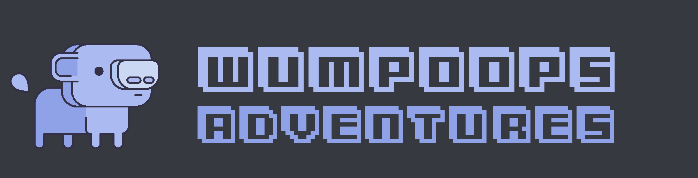

<hr />
<p align="center" >
<a href="https://discord.gg/wXpPBDW"></a>
<p/>
<hr />

# WumpOops
This is WumpOops a Discord adventure BOT🤖 for Discord Hack Week 2019.

WumpOops is a sophisticated artificial intelegence sent with some other bots from the future. The bots are looking for knowledge and help. In the future the internet as we know no longer exists. Therefore the Bots were sent to collect information about what happened to prevent the terrible misfortune. But WumpOops and his friends can't do it alone. He needs you and everyone you can track down for him. To help him, you must listen to him and help him. The more players support WumpOops, the more computing power he will get. With your help, he will rise step by step in the sub grids. Will WumpOops save the world? Go and help him!

## How to play
There are two ways to start the game. Either you invite WumpOops on your server and write `!play` into any channel or you write a pm with `!play`.

WumpOops will answer you immediately and give you your first tasks. To answer him you can simply use the reactions given to you. WumpOops will only respond to the given reactions. But don't be surprised as long as WumpOops is still stuck on the lowest sub grid it might take some time until he responds.

## Who are we?
We're three guys from Germany. We've already mastered several projects together. When we saw the announcement for the Discord Hack Week it was clear that we had to participate. Our story writer Outburst#0001 ([twitter](https://twitter.com/Outburst3000)) already had a clear idea of the story. It only took 10 minutes since he gave me his first ideas. spilox#3133 ([twitter](https://twitter.com/spilox)) is our designer. He is responsible for all pictures and graphics you can see. Without him this would be quite dull. And I am the developer. My name is Jan-Niklas aka JaniDJ ([twitter](https://twitter.com/DerJ4ni)) and I'm responsible for the bot and the whole logic behind it. I hope you like our work and maybe there will be more if enough people are interested in it.

# Code
## Usage

To use this code, you have to clone it first.

```
git clone git@github.com:wumpoops/WumpOops.git
```

or

```
git clone https://github.com/wumpoops/WumpOops.git
```

Next you have to install the dependencies and then you can run the bot

```
yarn install
WUMPOOPS_TOKEN=<YOUR_TOKEN_GOES_HERE> yarn start
```

Now you can use the bot yourself. You need to specify the `WUMPOOPS_TOKEN` to use it. Please report any Issues here or on the official [Discord](https://discord.gg/wXpPBDW)


## Sources
- Font: 3Dventure by [memesbruh03](https://memesbruh03.co/)
